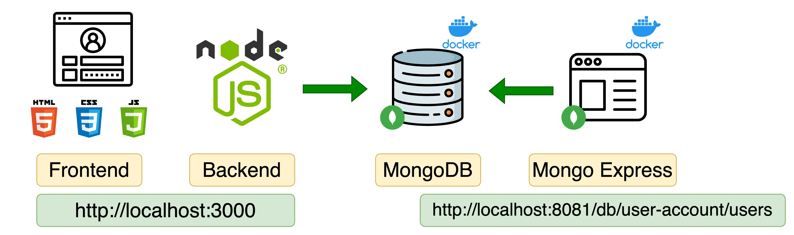
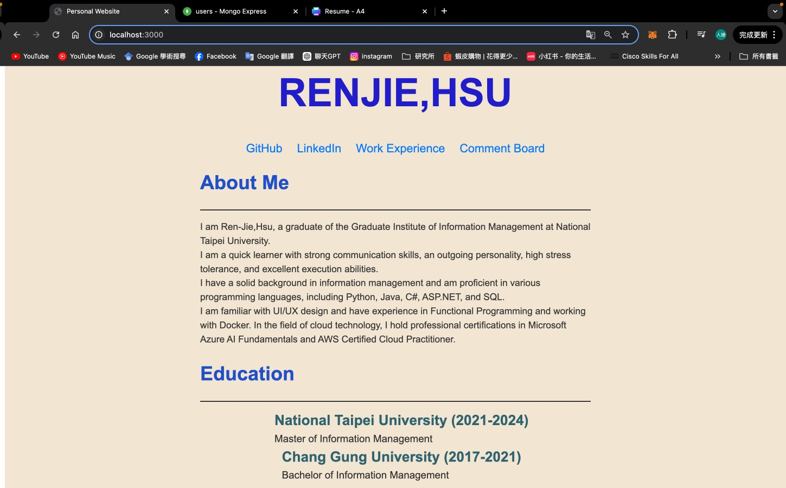
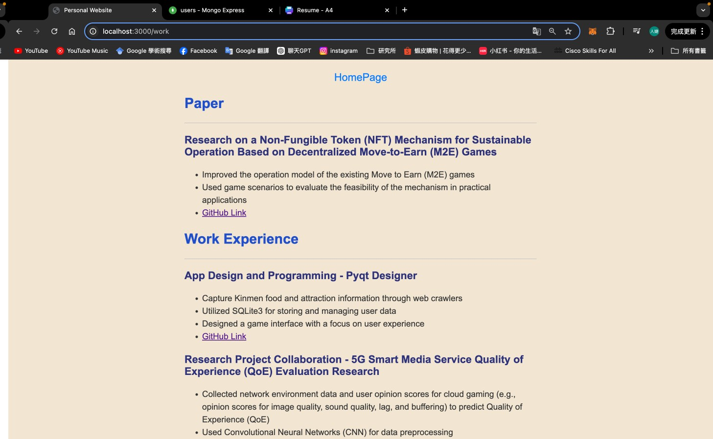
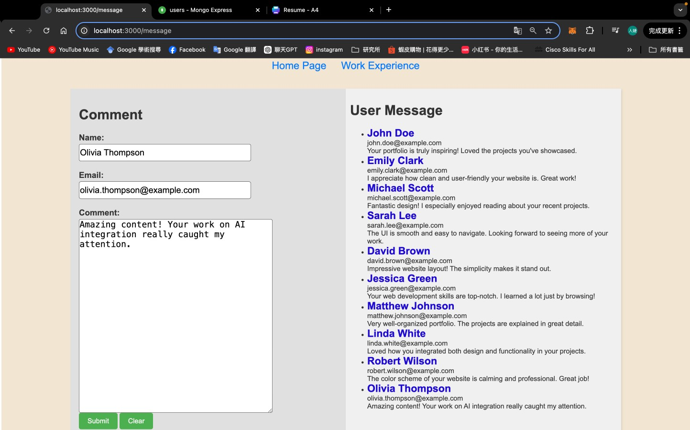
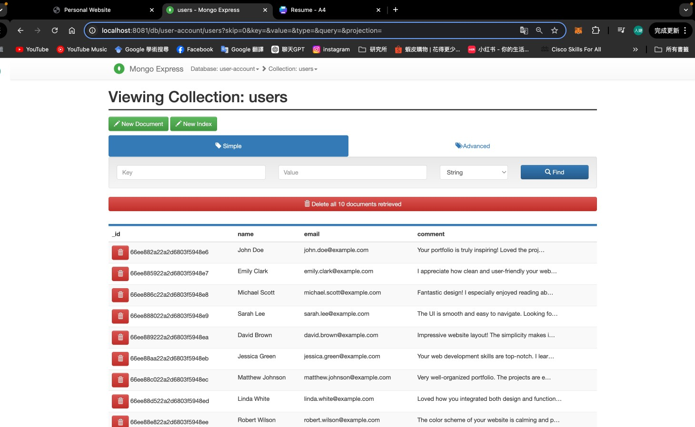

# Personal-website
Write a personal website on the front end. There is a message board in the website. The database of the message board uses mongodb express on docker image.

## Developing with Docker
This demo app shows a simple personal website set up using 
- **Homepage.html and work.html**, with pure js and css styles
- **message2.html** is a front-end webpage of a message board. Users can leave messages in message2.html. The message content will be stored in mongodb and returned to the web page.
- **nodejs backend** with express module
- **mongodb** for data storage

All components are docker-based

### With Docker
[source](https://gitlab.com/nanuchi/techworld-js-docker-demo-app)

#### To start the application

Step 1: Create docker network

    docker network create mongo-network 

Step 2: start mongodb 

    docker run -d -p 27017:27017 -e MONGO_INITDB_ROOT_USERNAME=admin -e MONGO_INITDB_ROOT_PASSWORD=password --name mongodb --net mongo-network mongo    

Step 3: start mongo-express
    
    docker run -d -p 8081:8081 -e ME_CONFIG_MONGODB_ADMINUSERNAME=admin -e ME_CONFIG_MONGODB_ADMINPASSWORD=password --net mongo-network --name mongo-express -e ME_CONFIG_MONGODB_SERVER=mongodb mongo-express   

_NOTE: creating docker-network in optional. You can start both containers in a default network. In this case, just emit `--net` flag in `docker run` command_

Step 4: open mongo-express from browser

    http://localhost:8081

Step 5: create `user-account` _db_ and `users` _collection_ in mongo-express

Step 6: Start your nodejs application locally - go to `app` directory of project 

    npm install 
    node server.js
    
Step 7: Access you nodejs application UI from browser

    http://localhost:3000

### With Docker Compose

#### To start the application

Step 1: start mongodb and mongo-express

    docker-compose -f docker-compose.yaml up
    
_You can access the mongo-express under localhost:8080 from your browser_
    
Step 2: in mongo-express UI - create a new database "my-db"

Step 3: in mongo-express UI - create a new collection "users" in the database "my-db"       
    
Step 4: start node server 

    npm install
    node server.js
    
Step 5: access the nodejs application from browser 

    http://localhost:3000

#### To build a docker image from the application

    docker build -t my-app:1.0 .       
    
The dot "." at the end of the command denotes location of the Dockerfile.

### Website 
#### Homepage

#### Work Experience

#### Comment Board

- When the user clicks the submit button, the form data (name, email, message) is extracted and encapsulated into an object.
- Send a **POST** request to the backend through the **fetch API** to store the data in **MongoDB**.
- When the page loads, a GET request is automatically sent to the backend to retrieve all user comments and display them on the web page.
- Clicking the clear button will reset all input boxes to empty.
#### Mongo Express
- MongoDB Express provides a web-based interface to interact with your MongoDB database.
- Visualize the collections and manage documents directly from a web UI.

